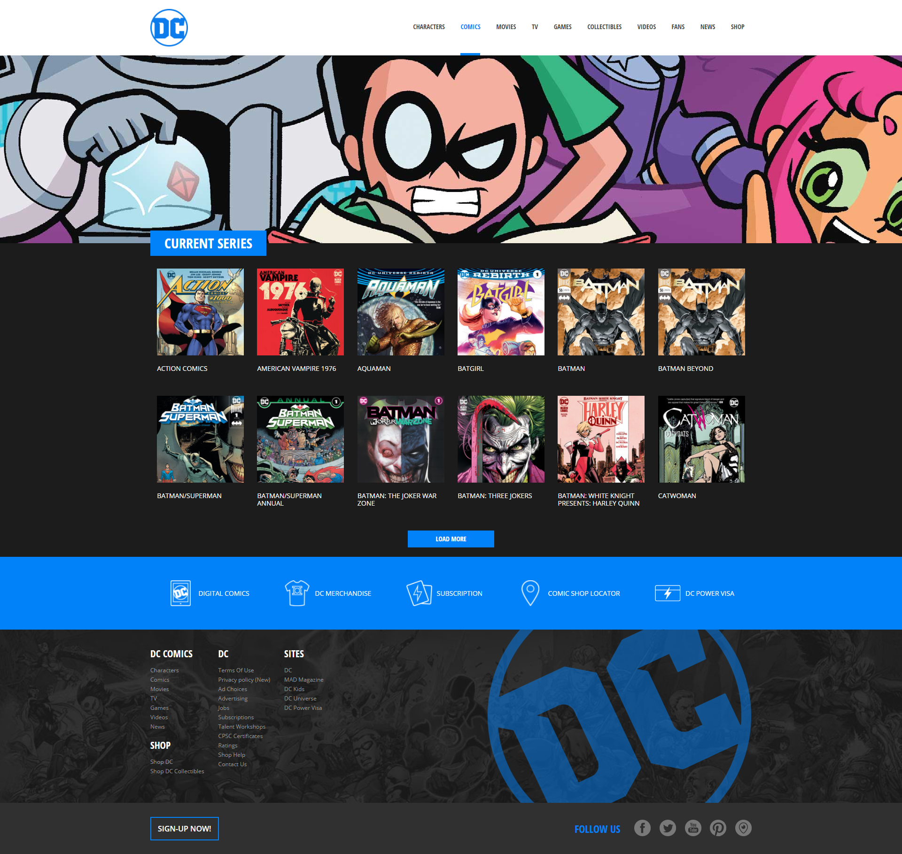

# Vite DC Comics

### Descrizione - Parte 1

Questo progetto è stato creato utilizzando Vite e Vue 3. L'obiettivo principale è implementare un layout strutturato secondo le specifiche fornite nello screenshot di riferimento.

È stata definita la struttura a macroblocchi che fornisce una base solida per il layout della pagina.

Per migliorare la gestione dello stile e rendere il codice più organizzato è stato implementato Sass.

### Design di riferimento

### Descrizione - Parte 2

Nella seconda fase dello sviluppo del progetto, mi sono concentrato su due attività principali per migliorare la qualità e la struttura complessiva del codice:

1. **Nuovi Componenti Aggiuntivi**:

   - **MainComic**: Componente dedicato alla visualizzazione delle informazioni relative ai fumetti. Questo componente mira a migliorare l'esperienza visiva e la gestione dei dati dinamici

   - **MainJumbo**: Componente progettato per la visualizzazione di un jumbotron

2. **Refactor Generale**:
   - È stato eseguito un refactor generale per semplificare la struttura del progetto. L'obiettivo è stato anche quello di agevolare la manutenzione futura del codice.

### Design di riferimento

